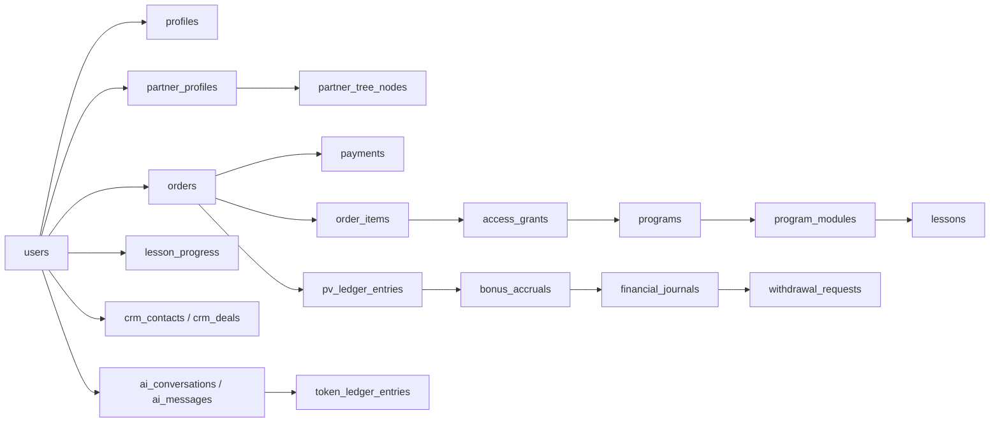

# RE:RISE — спецификация базы данных v1.0

> **Важно, 15.07.2026:** маркетинговые формулы, тарифы, статусы, активность и вывод в этом документе могли устареть. Их канонический источник — [`MARKETING_PLAN.md`](./MARKETING_PLAN.md). При расхождении всегда применяется `MARKETING_PLAN.md`; неподтверждённые сеть, комиссия, KYC/2FA, продуктовые права и внутренние переводы нельзя переносить в миграции как финальные правила.

Дата аудита: 13 июля 2026
Статус: готово для проектирования схемы и начала backend-разработки; требуется закрыть решения из раздела «Открытые вопросы» до production-запуска.

Этот документ заменяет прежнюю database-модель v0.1 и является главным источником требований к данным. Старые разделы о базе в `PRD.md`, `BONUS_RULES.md`, `API.md` и `product-blueprint.md` нужно считать историческим контекстом до их отдельного обновления.

## 1. Зачем нужна база данных

База данных — это не просто список информации, которую показывает интерфейс. Она определяет:

- какие сущности существуют в системе;
- как они связаны друг с другом;
- какие значения допустимы;
- что считается источником истины;
- как сохраняется история изменений;
- как защищаются деньги, PV, AI-токены и доступы;
- что происходит при оплате, возврате, смене статуса и выводе средств.

Экран — это представление данных. База — долговременная память и набор правил их целостности.

## 2. Итог аудита готовности

### Уже определено интерфейсом

- профиль пользователя и настройки уведомлений;
- пакеты Rise, Rise Pro, Rise Pro Max и продление;
- индивидуальные программы, покупки, доступы и прогресс обучения;
- AI Hub, модели, история, сохранённые результаты и расход AI-токенов;
- партнёр, наставник, реферальная ссылка, бинарная структура, PV и 16 статусов;
- CRM с этапами, карточками лидов, задачами, заметками и историей;
- денежный кошелёк, бонусы, история операций и вывод USDT (сеть пока не утверждена);
- материалы, файлы, Telegram-пространства и биржа труда;
- уведомления, безопасность, аудит и административные операции.

### Ещё не определено окончательно

- точность и округление бинарного дохода и матчинга;
- момент выплаты статусной премии: real-time конфликтует с правилом одной максимальной новой премии недели;
- маршрут PV покупок/продлений через неактивные позиции и наличие либо отсутствие компрессии; для матчинга отдельно утверждено отсутствие компрессии;
- календарная модель ежемесячного продления, цена апгрейда и влияние апгрейда на период активности;
- точный алгоритм свободной бинарной позиции и отдельные антифрод/chargeback-сценарии;
- точный состав доступов каждого тарифа и срок доступа к отдельным программам;
- платёжные провайдеры, основная расчётная валюта и юрисдикция;
- сеть, комиссия, SLA, лимиты, KYC/AML и 2FA для автоматического вывода USDT;
- правила внутренних переводов;
- что именно означает одна единица AI-токена;
- окончательный каталог курсов и фактическое содержимое части программ;
- режим CRM: личная CRM или командная с несколькими ответственными;
- входит ли биржа труда в первый production-релиз.

Это не мешает строить ядро. Изменяемые бизнес-правила необходимо хранить версионируемо, а не зашивать в колонки пользователя.

## 3. Рекомендованный технический фундамент

| Область | Решение |
| --- | --- |
| Основная БД | PostgreSQL 16+ |
| ORM | Prisma или Drizzle |
| Идентификаторы | UUID v7/UUID |
| Время | `timestamptz`, хранить в UTC |
| Денежные суммы | `numeric(20,8)`, никогда не `float` |
| PV | `numeric(20,4)` |
| AI-токены | `bigint` |
| Гибкие настройки | `jsonb`, только для конфигурации, не вместо основных связей |
| Файлы | S3-совместимое хранилище; в БД только метаданные и ключ объекта |
| Очереди | Redis + BullMQ или аналог для платежей, AI, бонусных расчётов и уведомлений |
| Чувствительные поля | шифрование на уровне приложения/KMS |

Все основные таблицы должны иметь `id`, `created_at`, `updated_at`. Финансовые и аудиторские записи не удаляются физически.

## 4. Главные архитектурные правила

1. Балансы денег, PV и AI-токенов считаются по неизменяемым журналам операций.
2. Кэшированный баланс допустим только как ускоритель, но не как источник истины.
3. Заказ, платёж, доступ и подписка — разные сущности.
4. Покупка не должна напрямую ставить флаг вроде `user.has_crm = true`.
5. Доступ выдаётся через `access_grants` на основании состава продукта.
6. Текущий ранг пользователя хранится вместе с историей его присвоений.
7. Спонсор в реферальной системе и родитель в бинарном дереве — разные связи.
8. Формулы бонусов и рангов версионируются с датой начала действия.
9. Webhook и повторный запрос должны быть идемпотентны.
10. Любое административное изменение денег, PV, доступов или статусов пишется в аудит.

## 5. Логическая карта доменов



## 6. Пользователи, авторизация и безопасность

### `users`

| Поле | Тип | Назначение |
| --- | --- | --- |
| `id` | uuid | внутренний идентификатор |
| `public_id` | text unique | публичный RE:RISE ID, например `1842` |
| `email_normalized` | text unique nullable | нормализованный email |
| `phone_e164` | text unique nullable | телефон в E.164 |
| `status` | enum | pending, active, suspended, blocked, deleted |
| `locale` | text | ru, en, es |
| `timezone` | text | IANA timezone |
| `last_login_at` | timestamptz nullable | последний вход |

### `profiles`

`user_id` unique FK, `first_name`, `last_name`, `avatar_object_key`, `country_code`, `city`, `telegram_username`, `birth_date` nullable.

### `auth_identities`

Позволяет подключить пароль, Telegram и другие способы входа без изменения `users`.

`user_id`, `provider`, `provider_subject`, `password_hash` nullable, `verified_at`, unique (`provider`, `provider_subject`).

### Дополнительные таблицы

- `roles`, `user_roles` — RBAC: user, partner, curator, manager, admin, super_admin;
- `auth_sessions` — активные устройства и отзыв сессий;
- `verification_challenges` — email/Telegram-коды, назначение, срок, число попыток;
- `notification_preferences` — telegram/email/push по категориям;
- `user_consents` — версия оферты, политики, партнёрского соглашения;
- `security_events` — входы, смена пароля, 2FA, подозрительные действия.

Пароль хранится только как Argon2id-хэш. Коды подтверждения хранятся в хэшированном виде и имеют TTL.

## 7. Каталог, тарифы, заказы и доступы

### `products`

| Поле | Назначение |
| --- | --- |
| `slug` unique | стабильный URL/код продукта |
| `type` | access_package, program, renewal, token_pack, service |
| `title`, `description` | контент продукта |
| `status` | draft, active, archived, coming_soon |
| `pv_amount` | PV, начисляемый за покупку |
| `sort_order` | порядок на витрине |
| `metadata` jsonb | бейдж, цвет, служебные настройки |

### `prices`

`product_id`, `amount numeric(20,8)`, `currency`, `billing_period`, `duration_days`, `starts_at`, `ends_at`, `is_active`.

Цена не должна храниться одной колонкой в `products`: это позволяет менять её без потери истории старых заказов.

### `product_entitlements`

Описывает, что именно даёт продукт.

| Поле | Пример |
| --- | --- |
| `product_id` | Rise Pro |
| `entitlement_type` | program, feature, material_collection, ai_allowance, partner_access |
| `resource_id` nullable | конкретная программа/коллекция |
| `quantity` nullable | количество AI-токенов |
| `duration_days` nullable | срок только после отдельного утверждения календарной модели |
| `config` jsonb | дополнительные ограничения |

### Коммерческие таблицы

- `orders`: user, status, currency, totals, referral attribution, idempotency key;
- `order_items`: snapshot названия, цены, PV и количества на момент покупки;
- `payments`: provider, external ID, amount, status, paid_at, raw status;
- `payment_attempts`: история попыток оплаты;
- `refunds`: полный/частичный возврат и причина;
- `subscriptions`: продукт, период, статус, start/end, auto_renew;
- `subscription_events`: created, renewed, paused, expired, cancelled;
- `access_grants`: user, entitlement, resource, starts_at, expires_at, status, source_order_item_id;
- `access_grant_events`: issued, extended, revoked, expired;
- `promo_codes` и `promo_redemptions` — если будут скидки.

### Канонический коммерческий seed

| Продукт | Цена | Личный бонус, максимум | PV, максимум | Тарифная PV-глубина | Матчинг |
| --- | ---: | ---: | ---: | ---: | --- |
| Rise | 90 USD | 30 USD | 30 PV | 3 физических уровня | 10% с 1-й спонсорской линии |
| Rise Pro | 300 USD | 90 USD | 90 PV | 9 физических уровней | по 10% с 1–2-й спонсорских линий |
| Rise Pro Max | 900 USD | 300 USD | 300 PV | 15 физических уровней | по 10% с 1–3-й спонсорских линий |
| Renewal | 30 USD | активному непосредственному спонсору — 9 USD | 9 PV | 3/9/15 уровней по тарифу активного получателя | не применяется |

Первый месяц включён в покупку тарифа и не является продлением. Продление ежемесячное, но точную календарную модель нельзя выражать через `duration_days` до отдельного решения. Продуктовый entitlement-состав тарифов не утверждён и не должен попадать в production seed как финальное правило.

## 8. Академия и прогресс обучения

### Основные таблицы

- `programs`: slug, title, subtitle, description, cover, status, sort_order;
- `program_modules`: program_id, title, description, sort_order, published_at;
- `lessons`: module_id, slug, title, lesson_type, content, video_url, duration_seconds, status, sort_order;
- `lesson_assets`: lesson_id, file_id, type, title, sort_order;
- `enrollments`: user_id, program_id, access_grant_id, enrolled_at, status;
- `lesson_progress`: user_id, lesson_id, status, progress_seconds, started_at, completed_at;
- `program_progress_cache`: user_id, program_id, completed_count, percent, recalculated_at;
- `homeworks`, `homework_submissions` — только если проверка заданий войдёт в MVP;
- `certificates` — после утверждения правил завершения.

Unique: (`user_id`, `lesson_id`) в `lesson_progress`; (`program_id`, `slug`) у модулей/уроков в соответствующем контексте.

Процент курса — вычисляемое значение. Кэш допускается, но фактом остаются статусы отдельных уроков.

### Нужна финализация контента

В интерфейсе определены 12 карточек программ, но полноценная ручная программа сейчас зафиксирована только для GPT — NEW. Часть остальных модулей и уроков генерируется как демонстрационный контент. Перед production seed нужен утверждённый каталог: программа → модули → уроки → файлы → доступ.

## 9. Материалы и файлы

- `material_collections`: title, description, category, status, sort_order;
- `materials`: collection_id, title, type, description, status, published_at, updated_at;
- `files`: storage_provider, object_key, original_name, mime_type, size_bytes, checksum, uploaded_by;
- `material_files`: material_id, file_id, title, sort_order;
- `tags`, `material_tags`;
- `material_access_rules`: collection/material → required entitlement;
- `material_download_events`: user, material/file, timestamp.

Не хранить бинарные файлы внутри PostgreSQL.

## 10. AI Hub и AI-токены

### AI-данные

- `ai_providers`: OpenAI/Anthropic/Google и статус;
- `ai_models`: provider, internal code, capabilities, pricing config, status;
- `ai_conversations`: user_id, title, selected_model_id, status;
- `ai_messages`: conversation_id, role, content, model_id, created_at;
- `ai_generations`: user, type, prompt, result metadata, status, model, timestamps;
- `ai_attachments`: generation/message → file;
- `saved_ai_results`: user, source message/generation, title;
- `prompt_templates`: system/user/custom templates, category, version.

### `token_wallets` и `token_ledger_entries`

Журнал типов:

```txt
purchase_credit
subscription_credit
bonus_credit
admin_credit
ai_usage_debit
expiration_debit
refund_debit
reversal
```

Каждая запись содержит `wallet_id`, `amount_signed`, `type`, `source_type`, `source_id`, `idempotency_key`, `occurred_at`. Баланс равен сумме журнала.

Перед реализацией нужно определить, является ли токен абстрактным внутренним кредитом, реальным количеством model tokens или «генерацией». В текущем UI эти понятия смешаны.

## 11. Партнёрская система, структура и ранги

### Партнёрские таблицы

- `partner_profiles`: user_id unique, partner_code unique, sponsor_user_id, activated_at, status;
- `referral_links`: partner_id, code unique, destination, status;
- `referral_events`: link_id, event_type (click/register/purchase), visitor/session hash, user/order nullable, occurred_at;
- `partner_tree_nodes`: user_id unique, parent_user_id, side (left/right), placed_at;
- `partner_tree_closure`: ancestor_user_id, descendant_user_id, depth — быстрые выборки структуры;
- `partner_period_stats`: кэш агрегатов по периоду, не источник истины.

Ограничения:

- пользователь не может быть своим спонсором или предком;
- у бинарного родителя не более одного прямого узла на каждой стороне;
- sponsor relation и бинарная позиция после размещения неизменяемы; исправление ошибочных данных требует отдельного корректировочного процесса, но не обычной смены спонсора или позиции;
- первый лично приглашённый ставится во внешнюю ногу, соответствующую стороне самого спонсора у его аплайна;
- со второго личного приглашённого спонсор выбирает левую или правую ногу, а конкретную свободную позицию система определяет автоматически по ещё не утверждённому алгоритму;
- при spillover личным спонсором остаётся фактический пригласивший;
- placement и sponsor не объединять в одно поле.

Тариф, активность и исторический статус моделируются как три независимых состояния. Первый включённый месяц либо оплаченное продление означает активность. В первые 12 месяцев непрерывной неактивности тариф и структура сохраняются, старый PV заморожен, новый PV и командные начисления недоступны; личный денежный бонус за нового лично приглашённого сохраняется по тарифу. После 12 месяцев тариф и PV обнуляются, но аккаунт, структура, ссылка и исторический статус сохраняются.

### Ранги

- `rank_definitions`: code, title, group, ordinal, status;
- `rank_rule_versions`: rank_id, version, conditions jsonb, valid_from, valid_to;
- `partner_rank_history`: user_id, rank_id, achieved_at, period_id, calculation_run_id, status;

Seed-порядок и канонические условия:

| # | Статус | Схлоп за неделю | Дополнительное условие | Разовая премия |
|---:|---|---:|---|---:|
| 1 | Партнёр I | 0 PV | покупка любого партнёрского тарифа | 0 USD |
| 2 | Партнёр II | 100 PV | 2 активных личных партнёра | 10 USD |
| 3 | Партнёр III | 200 PV | 4 активных личных партнёра | 20 USD |
| 4 | Эксперт I | 300 PV | 6 активных личных партнёров | 30 USD |
| 5 | Эксперт II | 400 PV | 8 активных личных партнёров | 40 USD |
| 6 | Эксперт III | 500 PV | 10 активных личных партнёров | 50 USD |
| 7 | Мастер I | 600 PV | Эксперт I+ в каждой бинарной ноге | 60 USD |
| 8 | Мастер II | 700 PV | Эксперт II+ в каждой бинарной ноге | 70 USD |
| 9 | Гранд-мастер | 800 PV | Эксперт III+ в каждой бинарной ноге | 80 USD |
| 10 | Лидер I | 1 000 PV | Мастер I+ в каждой бинарной ноге | 100 USD |
| 11 | Лидер II | 1 500 PV | Мастер II+ в каждой бинарной ноге | 150 USD |
| 12 | Топ-лидер | 2 000 PV | Гранд-мастер+ в каждой бинарной ноге | 200 USD |
| 13 | Ментор I | 3 000 PV | Лидер I+ в каждой бинарной ноге | 300 USD |
| 14 | Ментор II | 4 000 PV | Лидер II+ в каждой бинарной ноге | 400 USD |
| 15 | Премьер-ментор | 5 000 PV | Топ-лидер+ в каждой бинарной ноге | 500 USD |
| 16 | Визионер | 10 000 PV | Ментор I+ в каждой бинарной ноге | 10 000 USD |

Квалификационная неделя: понедельник 00:00 — воскресенье 23:59:59 по `Europe/Moscow`; учитывается PV, фактически схлопнувшийся за неделю. Исторический статус сохраняется, регулярного подтверждения нет, неактивный партнёр новый статус не получает. Момент выплаты статусной премии остаётся открытым из-за коллизии real-time и правила одной максимальной новой премии недели.

## 12. PV и бонусный движок

### Таблицы

- `pv_ledger_entries`: user, order_item, product, amount_signed, side, period, type, status;
- `bonus_periods`: start/end, settlement dates, status;
- `bonus_rule_sets`: version, type, config jsonb, valid_from, valid_to;
- `bonus_runs`: period, rule_set_version, status, started/completed, checksum;
- `bonus_accruals`: beneficiary, type, amount, currency, source order/PV/run, status;
- `bonus_accrual_events`: pending, approved, reversed, paid;
- `bonus_adjustments`: ручная корректировка с обязательной причиной и администратором.

### Типы, которые уже отражены UI

```txt
direct_purchase
direct_subscription
binary
matching
quick_start
rank
manual_adjustment
reversal
```

### Обязательный поток

```txt
payment paid
→ order completed
→ access granted
→ PV ledger entry
→ bonus period aggregation
→ versioned bonus run
→ pending accrual
→ approval / hold
→ financial journal posting
→ available balance
```

Нельзя пересчитывать бонусы из текущего состояния дерева без сохранения версии правил и входных данных расчёта.

## 13. Финансовый кошелёк

Для денег рекомендуется двойная бухгалтерская запись.

### Таблицы

- `financial_accounts`: owner_type/id, asset_code, account_type (pending/available/locked/fee/platform);
- `financial_journals`: business operation, external reference, idempotency key, status, occurred_at;
- `financial_postings`: journal_id, account_id, amount_signed;
- `wallet_balance_cache`: account/user/asset, balance, recalculated_at;
- `correction_debts`: user, amount, asset, reason, status, created_by, resolved_at;
- `correction_debt_events`: debt, amount_signed, source_accrual/journal, reason, actor, occurred_at;

Для каждого завершённого журнала сумма проводок по одному активу должна равняться нулю.

Корректировочный долг хранится отдельно от доступного баланса: будущие начисления сначала погашают долг, а остаток становится доступным. Создание, изменение и отмена долга требуют причины и аудита.

История операций в интерфейсе строится из `financial_journals` и связанных проводок, а не хранится отдельным текстовым списком.

### Вывод средств

- `payout_methods`: user, asset USDT, network nullable, address_encrypted, address_hash, status, verified_at;
- `withdrawal_requests`: user, payout_method, gross_amount, fee_amount, net_amount, asset, status, requested_at;
- `withdrawal_status_history`: request, from/to status, actor, reason, timestamp;
- `blockchain_transfers`: withdrawal, tx_hash unique, network, confirmations, broadcast_at, confirmed_at;
- `withdrawal_verifications`: challenge, attempts, expires_at.

Утверждённые и открытые правила:

| Правило | Значение |
| --- | --- |
| Актив | USDT |
| Сеть | не утверждена |
| Минимум | 100 USDT |
| Комиссия | оплачивает пользователь; точный размер не утверждён |
| Максимум заявки и прочие лимиты | не утверждены |
| Срок обработки | не утверждён |
| KYC/2FA и способ подтверждения | не утверждены |
| Целевой режим | автоматический вывод; точный операционный процесс не утверждён |

До production необходимо утвердить сеть, размер комиссии, лимиты, SLA, проверки и момент резервирования суммы. Эти параметры должны быть конфигурацией, а не жёсткими значениями схемы или frontend-кода.

Полный криптоадрес нельзя писать в логи, аналитику и уведомления; показывать только маску.

## 14. CRM

Не хранить всю карточку лида одной таблицей без истории.

- `crm_workspaces`: владелец/команда;
- `crm_pipelines`: workspace, title, status;
- `crm_stages`: pipeline, code, title, color, sort_order, terminal flag;
- `crm_contacts`: workspace, name, phone, email, telegram, source, owner_user_id;
- `crm_deals`: contact, pipeline, stage, title, amount, currency, product_id nullable, responsible_user_id, status;
- `crm_stage_history`: deal, from_stage, to_stage, moved_by, moved_at;
- `crm_tasks`: deal/contact, type, title, due_at, status, responsible;
- `crm_notes`: deal/contact, body, author, created_at, edited_at;
- `crm_activities`: call/message/meeting/system event, payload, timestamp;
- `crm_custom_fields` и `crm_custom_values` — только если поля должны настраиваться без миграций.

Seed этапов текущей воронки: `new`, `contact`, `meeting`, `deal`.

Нужно решить, является «Сделка» успешным финалом или рабочим этапом. Для аналитики обычно нужны отдельные terminal stages `won` и `lost`.

## 15. Профиль, уведомления и сообщества

- `notification_preferences`: channel + event category + enabled;
- `notifications`: user, type, title, body, read_at, action_url;
- `notification_deliveries`: channel, provider ID, status, attempts;
- `community_channels`: Telegram URL, access type, required entitlement, status, sort_order;
- `support_tickets` и `support_messages` — если поддержка будет внутри портала;
- `user_devices` — список активных устройств.

URL Telegram-каналов должны быть настройками/записями БД, а не константами frontend-кода.

## 16. Биржа труда — отдельный модуль

Если биржа входит в релиз:

- `talent_profiles`, `portfolio_items`, `skills`, `talent_skills`;
- `job_projects`: client, category, title, description, budget range, currency, deadline, format, status;
- `project_skills`;
- `project_applications`: project, applicant, message, proposed amount, status;
- `project_assignments`;
- `project_reviews`.

Если биржа не входит в MVP, эти таблицы не следует создавать заранее: достаточно зарезервировать модуль и API namespace.

## 17. Маркетинговые баннеры и продуктовый контент

- `banners`: placement, locale, eyebrow, title, text, image_file_id, action_type, action_target, start/end, status, sort_order;
- `content_translations`: entity_type, entity_id, locale, field, value — если контент управляется из админки;
- `feature_flags`: code, enabled, rollout config;
- `system_settings`: versioned operational settings, не секреты.

## 18. Системные таблицы

- `audit_logs`: actor, action, entity type/id, before/after jsonb, IP, user agent, reason;
- `webhook_events`: provider, external_event_id unique, payload encrypted/jsonb, status, processed_at;
- `outbox_events`: транзакционный outbox для очередей и уведомлений;
- `idempotency_keys`: scope, key, response reference, expires_at;
- `admin_comments`: внутренние комментарии к пользователям/выплатам;
- `background_jobs`: только если очередь не предоставляет достаточный журнал.

## 19. Ключевые индексы и ограничения

- unique: normalized email, phone, Telegram provider ID, public ID, referral code, product/program slug;
- indexes: все FK, `created_at` для журналов, (`user_id`, `status`), (`period_id`, `status`);
- payment webhook: unique (`provider`, `external_event_id`);
- payment: unique (`provider`, `external_payment_id`);
- lesson progress: unique (`user_id`, `lesson_id`);
- binary placement: unique (`parent_user_id`, `side`);
- rank history: partial unique для одного текущего активного ранга пользователя;
- payout method: unique (`user_id`, `asset`, `network`, `address_hash`);
- journal: unique idempotency key в пределах типа операции;
- checks: суммы > 0 там, где знак не используется; валюта uppercase; `ends_at > starts_at`;
- foreign keys с `restrict` для финансовых данных и осмысленным `cascade` только для чернового контента.

## 20. Что вычисляется, а что хранится

| Значение в UI | Источник |
| --- | --- |
| Доступно к выводу | сумма доступных financial postings |
| На проверке | pending/held accounts |
| Выплачено за период | завершённые withdrawal journals |
| AI-баланс | сумма token ledger |
| Процент курса | завершённые уроки / доступные уроки |
| Личный/командный PV | PV ledger по периоду и структуре |
| Количество партнёров | partner tree query/cache |
| Активные партнёры | активный access/subscription + правило активности |
| CRM-счётчики | количество deals по stage |
| Конверсия CRM | stage history, а не текущее число карточек |

Текстовые KPI с экрана не должны вручную сохраняться как независимые числа.

## 21. Основные транзакционные сценарии

### Оплата продукта

1. Создать order и order items со snapshot цены/PV.
2. Создать payment attempt.
3. Принять и идемпотентно обработать webhook.
4. В одной транзакции завершить order, выдать entitlements/access grants и записать outbox event.
5. Асинхронно создать PV, бонусные события, AI-токены и уведомление.

### Возврат

1. Создать refund.
2. Отозвать/сократить доступ согласно политике.
3. Создать обратные PV и bonus entries, не редактировать старые.
4. Создать финансовые reversal postings.

### Вывод USDT

1. Проверить актив USDT, утверждённый минимум 100 USD, доступный баланс, адрес и только те дополнительные политики, которые будут отдельно утверждены.
2. Идемпотентно создать заявку; момент резервирования available → locked должен следовать будущему утверждённому правилу.
3. Автоматически обработать заявку по утверждённой конфигурации сети, комиссии, лимитов и верификации.
4. После подтверждения сети завершить финансовые проводки; при отказе безопасно освободить зарезервированную сумму.

Пока сеть, комиссия, SLA, лимиты и проверки не утверждены, этот сценарий нельзя считать готовой production-спецификацией.

### Перемещение CRM-сделки

1. Обновить `crm_deals.stage_id`.
2. Записать `crm_stage_history`.
3. Создать system activity.
4. При необходимости запустить автоматизацию/уведомление через outbox.

## 22. Безопасность и персональные данные

- разделить публичные, персональные и финансовые данные;
- шифровать payout addresses и критичные реквизиты;
- не хранить CVV и полные банковские данные;
- ограничить доступ админов по ролям и логировать чтение чувствительных данных;
- предусмотреть экспорт и обезличивание данных пользователя;
- настроить резервное копирование и проверку восстановления;
- использовать row-level authorization в сервисном слое;
- секреты провайдеров хранить в secret manager, не в БД открытым текстом.

## 23. Открытые решения перед production-схемой

### P0 — блокируют финальные финансовые миграции

1. Страна регистрации бизнеса и юрисдикция пользователей.
2. Основная валюта учёта: USD, USDT или несколько активов.
3. Платёжные способы на запуске: карта, USDT, внутренний баланс.
4. Сеть, комиссия, SLA, лимиты, KYC/AML и 2FA для автоматического вывода USDT.
5. Точность и округление бинарного дохода/матчинга; правила возвратов и chargeback.
6. Момент выплаты статусной премии при коллизии real-time и одной максимальной новой премии недели.
7. Календарная модель продления, границы периода и раннее продление.
8. Маршрут PV покупок/продлений через неактивные позиции и наличие либо отсутствие компрессии (для матчинга отсутствие компрессии уже утверждено).
9. Цена апгрейда и влияние апгрейда на период активности.
10. Точный алгоритм автоматической свободной бинарной позиции.
11. Правила внутренних переводов.

### P1 — нужны до наполнения production seed

12. Точный entitlement matrix Rise / Rise Pro / Rise Pro Max / Renewal.
13. Какие программы входят в пакеты и какие продаются отдельно.
14. Срок отдельной программы: бессрочный или пока активна подписка.
15. Значение и срок жизни AI-токена.
16. Финальный каталог программ, модулей, уроков и материалов.

### P2 — можно решить после запуска ядра

17. Командная модель CRM и настраиваемые поля.
18. Биржа труда в MVP или следующей версии.
19. Хранение переводов в БД или в коде.
20. Внутренняя поддержка или только Telegram.

## 24. Что передать backend-разработчику

Этот документ является data-domain handoff. На его основе разработчик должен подготовить:

1. ER-диаграмму с cardinality и nullable-полями.
2. Prisma/Drizzle schema.
3. Начальную миграцию без неутверждённых формул в коде.
4. Seed для тарифов, 16 рангов, CRM-этапов и утверждённых программ.
5. Сервисные транзакции purchase/refund/withdrawal/access/token usage.
6. Политику idempotency для платежей, AI и bonus runs.
7. Unit/integration tests для ledger-инвариантов.
8. Политику резервного копирования, миграций и rollback.

## 25. Рекомендуемый порядок реализации

1. Identity + users + roles.
2. Products + prices + orders + payments + access grants.
3. Academy + enrollments + lesson progress + materials.
4. Token ledger + AI conversations/messages.
5. Partner profile + referral attribution + tree.
6. PV ledger + direct bonus; затем versioned binary/matching engine.
7. Financial ledger + withdrawals.
8. CRM.
9. Notifications, audit, admin.
10. Биржа труда — отдельным этапом.

## 26. Финальный вывод

Текущий портал достаточно проработан, чтобы начать проектирование и разработку базы. Однако он ещё не является окончательной бизнес-спецификацией финансовой и партнёрской логики.

Правильный следующий шаг — не пытаться заранее создать «вечную» базу без миграций. Нужно построить устойчивое ядро с журналами, версиями правил и access grants, параллельно закрыв P0/P1 решения. Тогда дальнейшие изменения тарифов, курсов, рангов и бонусов не потребуют ломать фундамент.
